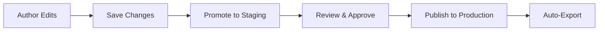

# K-Maker

<figure style="float:right; width:250px; margin-top:-75px;">
  
  <figcaption>Turn loose pile of information into wellorganised data</figcaption>
</figure>

_K-Maker is KurrawongAI's [Knowledge Graph](https://en.wikipedia.org/wiki/Knowledge_graph) creation and maintenance application. It provides specialised functions to create and govern any data and is particularly tuned to reference data, used by many other applications._

---

<figure style="width:85%;" >
    
    <figcaption>K-Maker editing a term within a vocabulary structured according to the <a href="https://www.w3.org/TR/skos-reference/">SKOS</a> vocabulary standard - one of the many common data models K-Maker supports. The edit is being tracked with version control</figcaption>
</figure>

## Challenges for enterprise reference data
Organisations typically manage dozens of reference datasets — product classifications, status codes, geographic hierarchies, industry standards — siloed in spreadsheets, duplicated across systems, and updated without governance or traceability. The result is lots of work ie needed for data integration, inconsistent reporting, and an inability to share reference data confidently across business units.  

The most common reference data pain points K-Maker is designed to address are:  

- **Different systems spread** - vocabularies here, spatial reference datasets there, organisation register somewhere else due to their different data models
- **No single source of truth** - fragmented resources with conflicting information due to copies being made for different systems/processes to use
- **No stable identifiers** — objects without persistent identity across systems, making reliable linking impossible
- **Limited version control or provenance** - ad-hoc spreadsheet management with no audit trail, change history or approval process
- **Inconsistent validation** - depending on how reference data is made, it may go through different, or no, validation

By using extensible open standards and a graph database, K-Maker can make, store and manage any kind of reference data - not just one of vocabularies, or spatial data or organisation but all.

By using universal data identity through [Linked Data](https://www.w3.org/wiki/LinkedData) principles, K-Maker managed data can act as a single source of truth, regardless of how and where data it manages is ultimately used.

By using in-build version control for whole data assets and the individual elements within them, provenance at asset and sub-asset level is always recorded.

By using the [SHACL](https://www.w3.org/TR/shacl12-core/) for K-Maker's data schemas, validators _AND_ UI generation, all data changes, whether manually or automatically made, are validate using the same validator ensuring consistency and quality.

<figure style="width:50%;">
    
    <figcaption>K-Maker makes user interface elements from data schemas defined using a validation language to ensure all data in its Knowledge Graph database is validated at every edit</figcaption>
</figure>

::KCard
Organisations increasingly recognise that managing reference data is needed for enterprise data. Vocabulary management is the accessible, high-value entry point — delivering immediate governance wins while building the foundation for broader reference data maturity. Reference Data maturity then allows fro total enterprise data management.
#title
Why Reference Data Management?
::

---

## The K-Maker solution
K-Maker delivers four core capabilities that directly address the root causes of reference data fragmentation — without requiring large, specailised, tool development.

::KCard
Create and curate machine-readable vocabularies to replace fragmented lists with version-controlled definitional points-of-truth. K-Maker ships with the powerful [SKOS](https://www.w3.org/TR/skos-primer/) data model built-in allowing you to represent concepts in hieararcies with multiple annotations and provenance.
#title
A sophisticated vocabulary model
::

&nbsp;

::KCard
K-Maker UIs are built using [SHACL (Shapes Constraint Language)](https://www.w3.org/TR/shacl12-core/) data definitions, ensuring every user interaction validates data against your required patterns at point of entry. Invalid data cannot enter your reference data store.
#title
SHACL UI with data integrity
::

<figure>
    
    <figcaption>An instance of K-Maker showing a workflow approval required for a data change</figcaption>
</figure>

::KCard
Formalised change and approval processes via a purpose-built web UI — with staging review, version control, and granular, role-based access. Every change is fully auditable from author edit through to production publication.
#title
Structured publishing workflows
::

&nbsp;

::KCard
Any downstream system can consume governed vocabularies via REST API or embeddable web components — in multiple formats including JSON-LD, Turtle, CSV and RDF/XML. Integrate once; all consumers benefit from every future vocabulary update automatically.
#title
Seamless system integration
::

---

## Our approach

### Data model - built on open semantic standards

K-Maker has been built on a series of [W3C](https://www.w3.org), [ISO](https://www.iso.org), [OGC](https://www.ogc.org) standards and [schema.org](https://schema.org):

* [SKOS](https://www.w3.org/TR/skos-reference/) (Simple Knowledge Organisation System): W3C's controlled vocabularies standard
* [ISO 19135](https://www.iso.org/standard/87753.html): ISO's registration and register governance standard
* [GeoSPARQL](http://www.opengis.net/doc/IS/geosparql/1.1): OGC's model for semantic spatial data
* [schema.org](https://schema.org): for many 'glue' model elements, joining other things
* [SHACL](https://www.w3.org/TR/shacl12-core/): W3C's graph validation language

<figure>
  
  <figcaption>A typical screen of K-Maker, configured for vocabulary editing, using SKOS & schema.org for the data model and SHACL for input validation</figcaption>
</figure>

KurrawongAI is a W3C and OGC member organisation and our staff edit standards and lead working groups within them and the ISO, so we know the standards we use very well.

### Integration & distribution
Downstream systems are able to readily consume governed vocabularies without custom per-system mappings. Integrate once; all consumers stay current with every future vocabulary update automatically.

::KCard
Systems store concept URIs and resolve meaning via REST endpoints. Two patterns are supported: simple static exports for lightweight caching, and dynamic server-side APIs for complex querying and filtering.
#title
REST API
::  

&nbsp;

::KCard
Embed a <prez-list> selector into any web application with two lines of code. Supports select, dropdown, radio button, table and autocomplete modes — configurable and previewable before deployment.
#title
Web components
::  

&nbsp;

::KCard
Every vocabulary is available for direct download in multiple formats. From full linked data to simple flat files — whatever your downstream consumer requires, with no additional configuration.
#title
Export formats
::  

### Publishing workflows
Every change to your data passes through a staged, version control-based approval workflow that follows [ISO 19135](https://www.iso.org/standard/87753.html)' processes. No data elements reach production without formal review and sign-off from designated approvers.

* **Author Edits**
    * Content owners make changes via a simple web UI, regardless of the type of object. Data validation runs on every save.
* **Save Changes**
    * Drafts are committed to version-controlled storage with full provenance metadata
* **Promote to Staging**
    * Changes are promoted to a staging environment for review
* **Review &amp; Approve**
    * Approvers review, comment, accept or reject — with a full audit trail captured
* **Publish to Production**
    * Approved content is published and immediately available to all consumers
* **Auto-Export**
    * Publication triggers automated export in all configured formats for downstream systems

<figure style="width:50%;">
  
  <figcaption>A K-Maker popup window showing a small change to an item's status, recorded in Git-style version control</figcaption>
</figure>

### Scalability - complexity and size

Vocabulary management is the entry point to reference data management and K-Maker handles that out-of-the-box, but it's a general-purpose Knowledge Graph administration platform which means it can handle just about any kind of data. It also that works with KurrawongAI's other tools, such as [Olis](/products/olis) for multi-graph management and [Prez](/products/prez) for Knowledge Graph display, so you can use it as you grown your organisation's reference data maturity.

In addition to vocabularies, it can be used to manage:

- **Domain models** - simple to complex ontologies, defining classes, properties and their relations. The next step up from collections fo vocabularies
- **Spatial data** - used to locate other data. Can be spatially links and used for map-based data selection
- **Validators** - it uses validators to validate all the things it edits and it cam maintain the validators themselves

::KCard
All you need to start with K-Maker is lists of controlled terms - to be made into standardised vocabularies. You can also define any data schema you like, and it can manage objects of that type too! If your organisation is unfamiliar with Knowledge Graph data schemas. KurrawongAI can assist.
#title
Low-effort entry point
::  

<!--
### How and where is it already used?

* for vocabulary management
  * by multiple Australian state governments
* for wide-ranging reference data management - vocabularies, registers, spatial data
  * by the Australian Federal government
* for specialised data models
  * within the Australian finance sector
-->