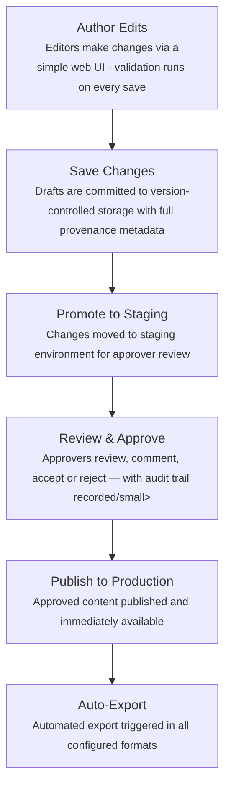

# K-Maker

_K-Maker is KurrawongAI's [Knowledge Graph](https://en.wikipedia.org/wiki/Knowledge_graph) creation and maintenance application - providing specialised functions to create and govern data as standards-compliant Knowledge Graphs. For reference data mangement in particular, these graphs are then readily available to other applications._

---
<figure style="float:right; width:250px; margin-left:75px;">
  
  <figcaption>Turn loose pile of information into well-organised data</figcaption>
</figure>

## Challenges for enterprise reference data

Organisations typically manage dozens of reference datasets — product classifications, status codes, geographic hierarchies, industry standards — siloed in spreadsheets, duplicated across systems, and updated without governance or traceability. The result is lots of work ie needed for data integration, inconsistent reporting, and an inability to share reference data confidently across business units.  

- **Differing source systems** - fragmented resources with conflicting definitions and underlying data models
- **No stable identifiers** — objects without persistent identity across systems, making reliable linking impossible
- **Limited version control or provenance** - ad-hoc spreadsheet management with no audit trail, change history or approval process
- **High barrier to enterprise solutions** - catalogues or database products may be appealing but require significant effort to implement

::KCard
Organisations increasingly recognise that managing reference data is needed for enterprise data. Vocabulary management is the accessible, high-value entry point — delivering immediate governance wins while building the foundation for broader reference data maturity. From there, improving organisational data maturity capabilities is a small step.
#title
Why Reference Data Management?
::

---

## The K-Maker solution
K-Maker delivers four core capabilities that directly address the root causes of reference data fragmentation — without requiring large, specailised, tool development.

::KCard
Create and curate machine-readable vocabularies to replace fragmented lists with version-controlled definitional points-of-truth. K-Maker ships with the powerful [SKOS](https://www.w3.org/TR/skos-primer/) data model built-in allowing you to represent concepts in hieararcies with multiple annotations and provenance.
#title
A sophisticated vocabulary model
::

&nbsp;

::KCard
K-Maker UIs are built using [SHACL (Shapes Constraint Language)](https://www.w3.org/TR/shacl12-core/) data definitions, ensuring every user interaction validates data against your required patterns at point of entry. Invalid data cannot enter your reference data store.
#title
SHACL UI with data integrity
::

&nbsp;

::KCard
Formalised change and approval processes via a purpose-built web UI — with staging review, version control, and granular, role-based access. Every change is fully auditable from author edit through to production publication.
#title
Structured publishing workflows
::

&nbsp;

::KCard
Any downstream system can consume governed vocabularies via REST API or embeddable web components — in multiple formats including JSON-LD, Turtle, CSV and RDF/XML. Integrate once; all consumers benefit from every future vocabulary update automatically.
#title
Seamless system integration
::

### How it works - from vocabulary pattern to Knowledge Graph

:KMakerDiagram

---

## Our approach

### Data model

K-Maker has been built on standards our team both works with, and contributes to. KurrawongAI is a W3C and OGC member organisation, our staff lead working groups and edit standards within them, as well as the ISO. You can be confident that we have incorporated this expertise in development of K-Maker for Knowledge GRaph data administration.

::KGrid{class="grid-cols-1 md:grid-cols-2 lg:grid-cols-3"}

::KCard
Using [SKOS](https://www.w3.org/TR/skos-reference/) (Simple Knowledge Organisation System): W3C's controlled vocabularies standard
#title
Machine-readable & self-describing concepts
::

::KCard
Using extensible, open standards and a graph database (handling organisational, spatial, stratographic or domain specific standards and more)
#title
Store and manage any type of reference data
::

::KCard
Using universal data identity through [Linked Data](https://www.w3.org/wiki/LinkedData) principles, regardless of how and where data is used
#title
Single, persistent source of truth
::

::K-Card
Using in-built version control for whole data assets and the individual elements within them
#title
Provenance records at asset and sub-asset level
::

::KCard
using the [SHACL](https://www.w3.org/TR/shacl12-core/) for K-Maker's data schemas, validators _AND_ UI generation, all data changes, whether manually or automatically made, are validated to the same quality
#title
Consistent data validation
::

:: 

---

### Integration & distribution
Downstream systems are able to readily consume governed vocabularies without custom per-system mappings. Integrate once; all consumers stay current with every future vocabulary update automatically.

::KCard
Systems store concept URIs and resolve meaning via REST endpoints. Two patterns are supported: simple static exports for lightweight caching, and dynamic server-side APIs for complex querying and filtering.
#title
REST API
::  

&nbsp;

::KCard
Embed a <prez-list> selector into any web application with two lines of code. Supports select, dropdown, radio button, table and autocomplete modes — configurable and previewable before deployment.
#title
Web components
::  

&nbsp;

::KCard
Every vocabulary is available for direct download in multiple formats. From full linked data to simple flat files — whatever your downstream consumer requires, with no additional configuration.
#title
Export formats
::  

---

### Publishing workflows
Every change to your data passes through a staged, version control-based approval workflow that follows [ISO 19135](https://www.iso.org/standard/87753.html)' processes. No data elements reach production without formal review and sign-off from designated approvers.

<figure>
  
  <figcaption>A K-Maker instance, configured for vocabulary editing, showing an edit screen for a concept highlighting proposed changes. The UI uses SKOS & schema.org for the data model and SHACL for input validation.</figcaption>
</figure>

<figure>
  
  <figcaption>A K-Maker popup window showing a small change to an item's status, in this instance viewed as the Git-style version control that is recorded.</figcaption>
</figure>

---

### Scalability - flexibility for future complexity and volume

Vocabulary management is a common entry point, but K-Maker is a broader Knowledge Graph administration platform and is designed to grow with your organisation's data maturity.

In addition to vocabularies, it can be used to manage:

- **Domain models** - simple to complex ontologies, defining classes, properties and their relations. The next step up from collections fo vocabularies
- **Spatial data** - used to locate other data. Can be spatially links and used for map-based data selection
- **Validators** - it uses validators to validate all the things it edits and it cam maintain the validators themselves

K-Maker also works with KurrawongAI's other tools, such as [Olis](/products/olis) for multi-graph management and [Prez](/products/prez) for Knowledge Graph display, which allows for continued growth and development of your Knowledge Graph capabilities as organisational data management matures.

::KCard
All you need to get started with K-Maker is your own data - lists of terms to be made into standardised vocabularies, data objects of relevance to your organisation, etc. If your organisation is unfamiliar with Knowledge Graph data schemas, KurrawongAI can help with that too.
#title
Low-effort entry point
::  

<!--
### How and where is it already used?

* for vocabulary management
  * by multiple Australian state governments
* for wide-ranging reference data management - vocabularies, registers, spatial data
  * by the Australian Federal government
* for specialised data models
  * within the Australian finance sector
-->